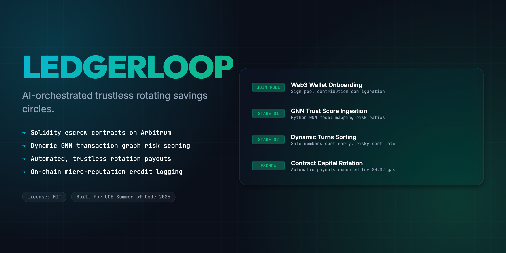
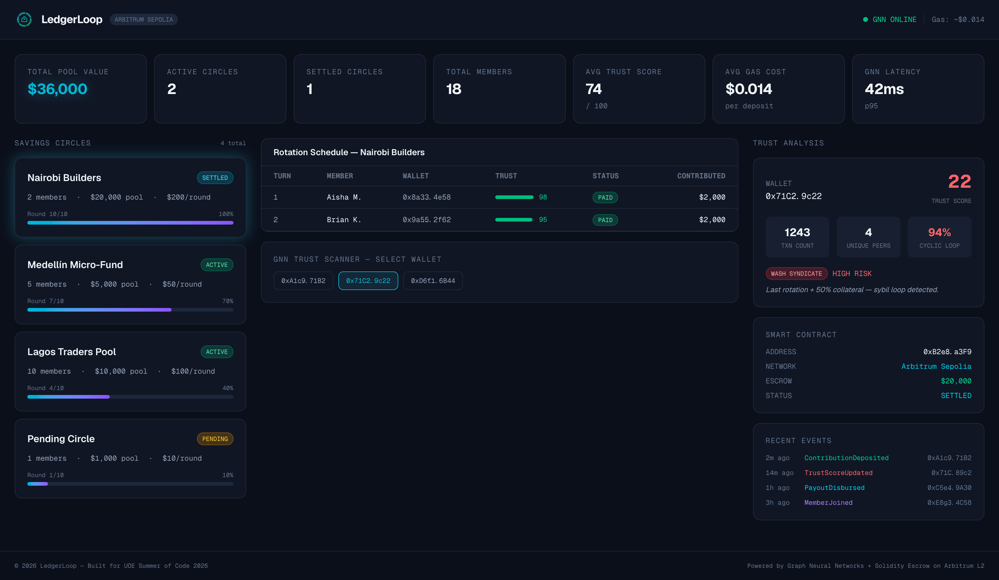
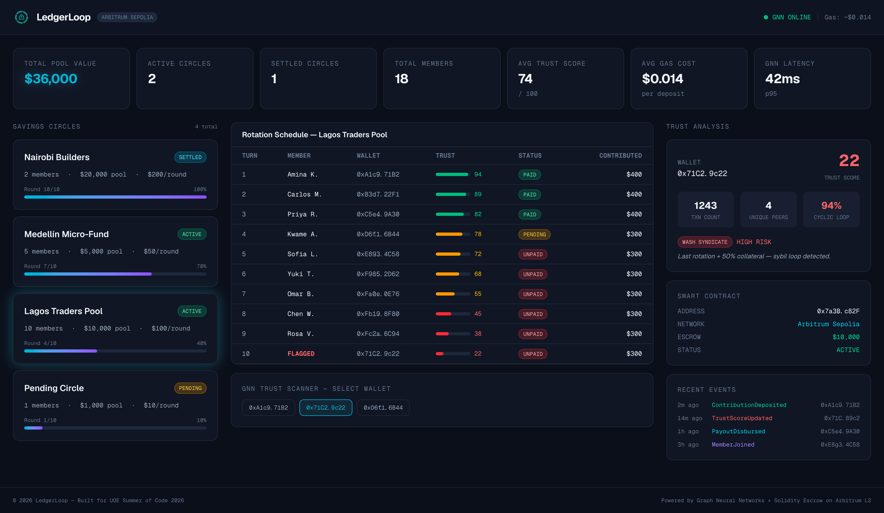
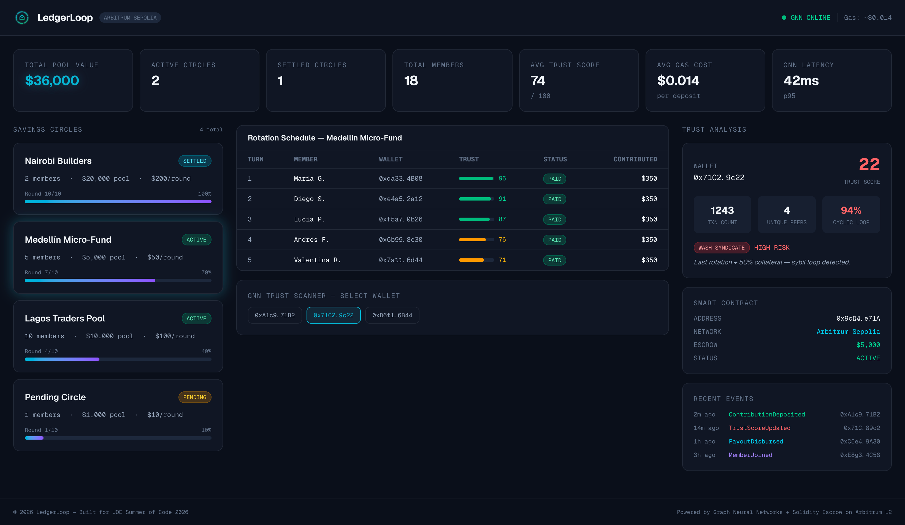
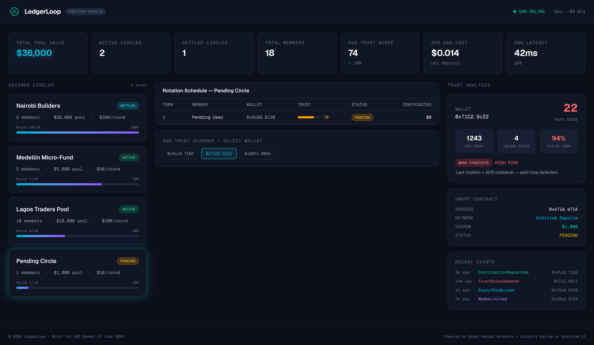
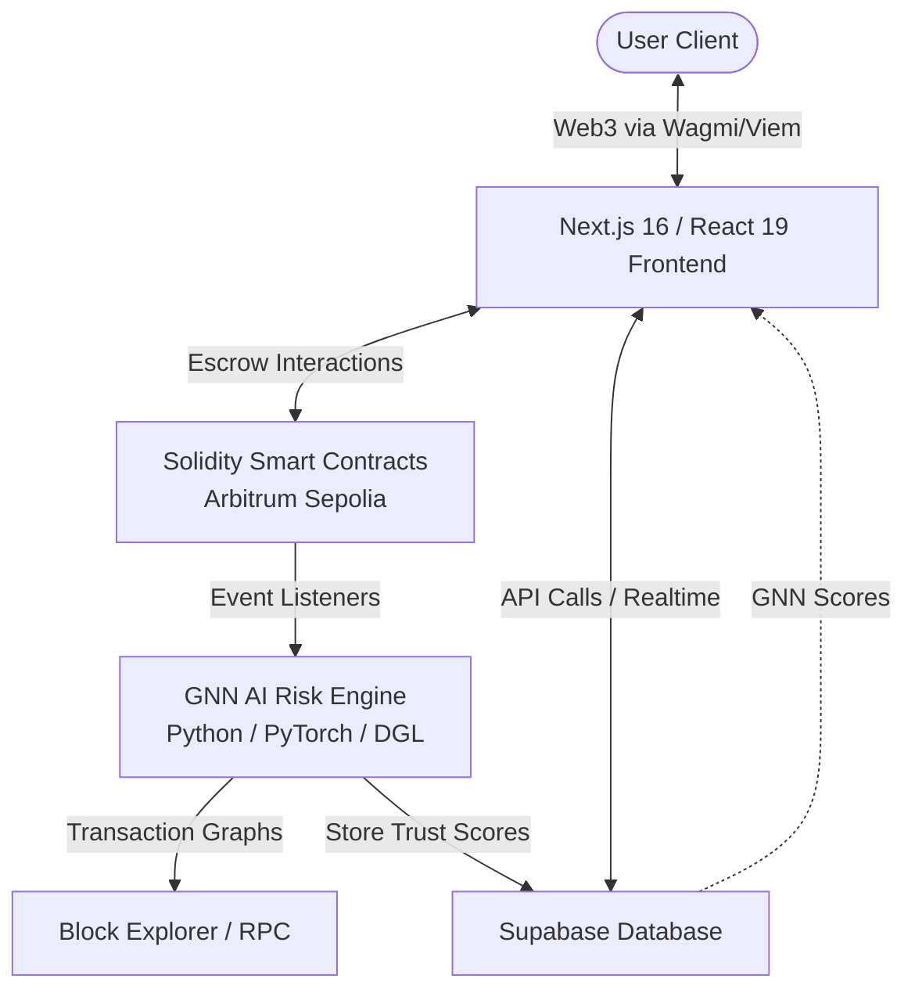
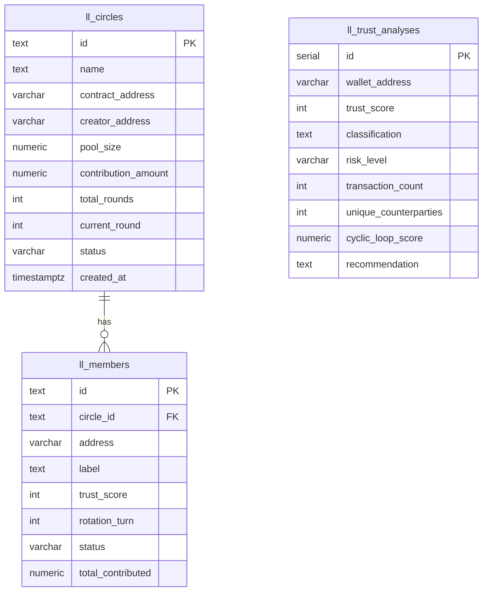

<div align="center">
  <h1>LedgerLoop 🔄</h1>
  <p><em>AI-orchestrated trustless rotating savings circles backed by on-chain escrow and Graph Neural Network credit-risk scoring</em></p>
  

  <br/>

  [](https://ledgerloop.edycu.dev)
  [](https://ledgerloop.edycu.dev/pitch.html)
  [](#-testing--ci)
  [](https://uoe-summer-of-code.devpost.com/)

  <br/>

  
  
  
  
  [](https://github.com/edycutjong/ledgerloop/actions/workflows/ci.yml)

</div>

---

## 💡 The Problem & Solution

Over **1 billion unbanked people** globally rely on rotating savings circles (*tandas*, *cundinas*, *ROSCAs*) as their primary source of capital. These systems suffer from two fatal failures: **organizer fraud** and **participant default**.

**LedgerLoop** eliminates both by replacing human organizers with Solidity smart contract escrows and using a Graph Neural Network to dynamically score trust, scheduling higher-risk members for later payouts.

**Key Features:**
- ⛓️ **Trustless Escrow**: Deposits held in auditable Solidity contracts on Arbitrum Sepolia (~$0.014/tx)
- 🧠 **GNN Trust Scoring**: Graph Neural Network evaluates wallet transaction patterns to detect sybil clusters and wash-trading loops
- 🔄 **Dynamic Rotation**: Trust scores automatically determine payout order — riskier members get later turns or require collateral
- 📊 **On-Chain Credit History**: Completed cycles build portable, verifiable credit for unbanked users

## 📸 Screenshots

<details>
<summary><strong>Click to expand all dashboard screenshots</strong></summary>

### Nairobi Builders — SETTLED ✅
> Completed 10/10 rounds with 2 members and a $20,000 pool. All contributions paid. The GNN Trust Scanner flagged wallet `0x71C2.9c22` as **WASH SYNDICATE / HIGH RISK** (trust score: 22, cyclic loop: 94%) — this member was automatically pushed to last rotation + 50% collateral.



---

### Lagos Traders Pool — ACTIVE 🟢
> 10-member circle at round 4/10 with $10,000 pool. Members sorted by trust score — Turn 10 is held by the flagged `0x71C2.9c22` wallet (trust: 22). Members with scores below 70 show red/amber trust bars. 3 members PAID, 7 UNPAID.



---

### Medellín Micro-Fund — ACTIVE 🟢
> 5-member micro-savings circle at round 7/10. All 5 members have contributed ($350 each). Trust scores range from 71 to 96. Smart contract holds $5,000 escrow on Arbitrum Sepolia.



---

### Pending Circle — PENDING ⏳
> New circle with 1 member awaiting more participants. $1,000 pool target, $10/round. The pending member has a trust score of 70. Smart contract deployed but not yet active.



</details>

## 🏗️ Architecture & Tech Stack



| Layer | Technology |
|---|---|
| **Frontend** | Next.js 16 (App Router), React 19, Tailwind CSS v4 |
| **Smart Contracts** | Solidity (Hardhat), deployed on Arbitrum Sepolia |
| **AI Risk Engine** | Python 3.12, FastAPI, PyTorch + DGL (Graph Neural Network) |
| **Database** | Supabase (PostgreSQL) |
| **Web3** | viem, wagmi |

## 🗄️ Database Schema

Data is persisted in **Supabase (PostgreSQL)** with Row-Level Security enabled. All tables use the `ll_` prefix to namespace within the shared Supabase instance.



| Table | Purpose | Rows |
|---|---|---|
| `ll_circles` | Savings circle configuration — pool size, round progress, contract address | 4 |
| `ll_members` | Circle participants — wallet, trust score, rotation slot, contribution status | 18 |
| `ll_trust_analyses` | GNN trust analysis results — risk classification, cyclic loop detection | 3 |

> **RLS Policy**: Anonymous read access enabled on all tables. Write operations require `service_role` key.

## 🚀 Getting Started

### Prerequisites
- Node.js ≥ 20
- npm

### Installation
```bash
git clone https://github.com/edycutjong/ledgerloop.git
cd ledgerloop
npm install
cp .env.example .env.local
npm run dev
```

## 🧪 Testing & CI

**54 passing tests** across 5 test suites — covering mock data integrity, component rendering, interactive state transitions, trust analysis branching, and data cross-validation.

```bash
npm test              # Run all 54 tests
npm run test:coverage # Coverage report
npm run lint          # ESLint
npm run typecheck     # TypeScript check
npm run build         # Production build
npm run ci            # Full CI pipeline (lint + typecheck + test + build)
```

CI runs on Node.js 20, 22, and 24 via GitHub Actions on every push.

## 📁 Project Structure
```
ledgerloop/
├── docs/              # README assets
├── src/
│   ├── app/           # Next.js pages + __tests__/
│   └── lib/           # Mock data & utilities + __tests__/
├── .github/           # CI workflows
├── .env.example       # Environment template
├── LICENSE            # MIT
└── README.md          # You are here
```

## Acknowledged Limitation
**Cold-Start Trust**: Brand-new wallets with zero on-chain transaction history cannot receive a GNN trust score and are excluded from circle membership until they accumulate a minimum transaction graph.

## 📄 License
[MIT](LICENSE) © 2026 Edy Cu

## 🙏 Acknowledgments
Built for **UOE Summer of Code 2026**. Thank you to the organizers and judges for the opportunity.
